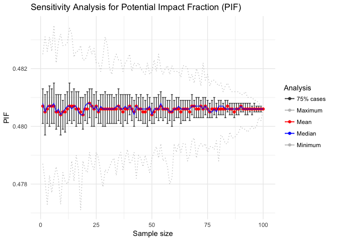

pif: **Potential Impact Fraction**
================

Introduction
------------

The *pif* package works for the estimation of the [Potential Impact Fraction](http://www.who.int/publications/cra/chapters/volume2/2129-2140.pdf) as well as the [**Population Attributable Fraction**](http://www.who.int/healthinfo/global_burden_disease/metrics_paf/en/) from cross-sectional survey data.

Installing
----------

*pif* is still at its developmental stage. You need to install it from Github:

``` r
install.packages(devtools)
devtools::install_github("INSP-RH/pif")
```

Examples
--------

### **Population Attributable Fraction**

Consider that exposure to a certain phenomena is modeled by a random variable \(X\) which is normally distributed with mean \(µ\) and variance \(σ^2\). In addition, consider the relative risk function associated to the exposure to be:

<div>
<center>

</center>
</div>

where \(X\) denotes the exposure and \(ø\) the length (in time) exposed.

This function can be coded as:

``` r
rr <- function(x, theta){exp(theta*x)}
```

The **Population Attributable Fraction** is given by [the equation](https://github.com/INSP-RH/pif/blob/master/Theoretical/Worked_formulas.pdf):

<center>

</center>
In particular, if we let \(ø = 1/9\), \(µ = 9\) and \(σ = 3\):

<center>

</center>
#### Using the package

Let \(ø\) be estimated by \(ø_{est} = 0.11\). Consider a random sample of the \(X's\):

``` r
set.seed(242)
X <- rnorm(1000, 9, 3)
```

We use our package to estimate the population atributable fraction:

``` r
library(pif)
pif(X, 0.11, rr)
```

    ## [1] 0.6548373

### **Potential Impact Fraction**

Consider the same problem as before. We are now interested in estimating the effects of a counterfactual. As an example, consider a transformation of \(X\) given by: \(T(X) = aX + b\).

In this case, the **Potential Impact Fraction** is given by [the equation](https://github.com/INSP-RH/pif/blob/master/Theoretical/Worked_formulas.pdf):

<center>

</center>
Assuming the same values as above and considering \(a = 1/2\) and \(b = -1\) we have:

<center>

</center>
#### Using the package

We use our package to estimate the **Potential Impact Fraction**. First: we code the counterfactual function:

``` r
cft <- function(X){0.5*X - 1}
```

Then we estimate the PIF:

``` r
pif(X, 0.11, rr, cft)
```

    ## [1] 0.480594

### Sensitivity analysis

#### Plots

The command `plotpif` allows us to analyze how the potential impact fraction varies as the values of \(ø\) change:

``` r
plotpif(X, 0, 0.3, rr, cft)
```


#### Sensitivity function

The command `sensitivity.pif` allows us to analyze how our estimates for the potential impact fraction would vary had we excluded some part of the exposure sample.

``` r
sensitivity.pif(X, 0.11, rr, cft)
```



What is missing?
----------------

The project still needs testing and debugging. In particular, testing if the point-estimates are near the theoretical estimates developed [here](https://github.com/INSP-RH/pif/blob/master/Theoretical/Worked_formulas.pdf) .
Furthermore, we are working on the confidence intervals for the Impact Fraction. Adding error codes for robustness to the functions is also required.

Please feel free to contribute to the project.

Contributor Code of Conduct
---------------------------

As contributors and maintainers of this project, we pledge to respect all people who contribute through reporting issues, posting feature requests, updating documentation, submitting pull requests or patches, and other activities.

We are committed to making participation in this project a harassment-free experience for everyone, regardless of level of experience, gender, gender identity and expression, sexual orientation, disability, personal appearance, body size, race, ethnicity, age, or religion.

Examples of unacceptable behavior by participants include the use of sexual language or imagery, derogatory comments or personal attacks, trolling, public or private harassment, insults, or other unprofessional conduct.

Project maintainers have the right and responsibility to remove, edit, or reject comments, commits, code, wiki edits, issues, and other contributions that are not aligned to this Code of Conduct. Project maintainers who do not follow the Code of Conduct may be removed from the project team.

Instances of abusive, harassing, or otherwise unacceptable behavior may be reported by opening an issue or contacting one or more of the project maintainers.

This Code of Conduct is adapted from the Contributor Covenant, version 1.0.0, available from <http://contributor-covenant.org/version/1/0/0/>

Licence
-------

This package is free and open source software, licensed under [GPL-3](https://www.gnu.org/licenses/gpl-3.0.html).

If you use this package please don't forget to cite it.

Authors
-------

-   Rodrigo Zepeda-Tello <rodrigo.zepeda@insp.mx>
-   Dalia Camacho-García-Formentí <daliaf172@gmail.com>
